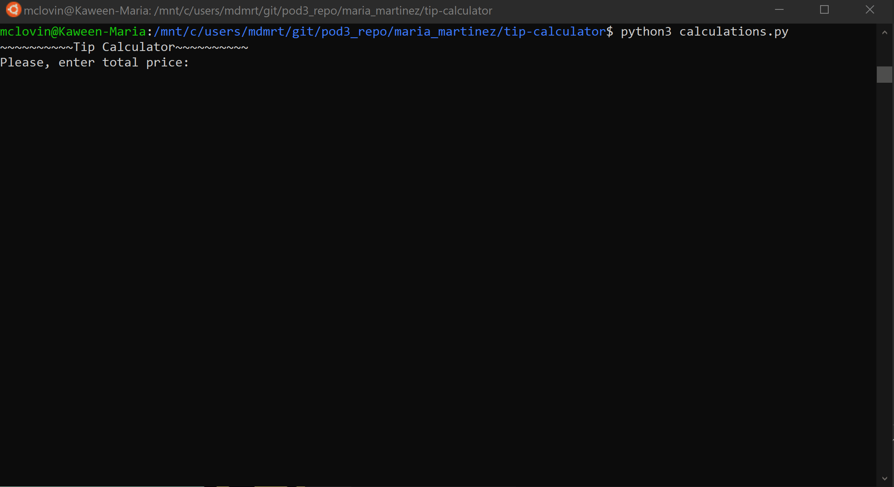

# Tip Calculator

Tip Calculator is a simple calculator that calculates the bill by percentage of tip amount the user would like to give and return how much is the tip and bill per person

## Run

```bash
python3 calculations.py
```
## Video Walkthrough


GIF created with [LiceCap](http://www.cockos.com/licecap/).
